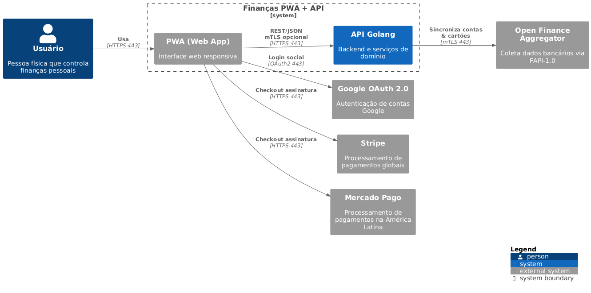

# FinAssisty

Um repositório com todo o código e documentação para o MVP de controle de
finanças pessoais, incluindo a PWA em React, a API em Golang e serviços auxiliares
(Open Finance Aggregator, observabilidade, banco de dados e cache).

## Primeiros passos

Siga estes passos para clonar o projeto e já começar a explorá-lo:

1. **Clone o repositório**

```bash
  git clone git@github.com:seu-usuario/financas-mvp.git
  cd financas-mvp
```

2. Veja a estrutura

- `docs/architecture/` – diagramas C4 em PlantUML e PNG
- `app/` – código da Progressive Web App (React + TypeScript)
- `api/` – backend em Golang (ECS/Fargate)
- `infra/` – configurações de infraestrutura (CloudFormation/Terraform)
- `Makefile` – comandos úteis (incluindo make docs)
- `.github/` – pipelines de CI/CD

## Instalação

### Requisitos

- [Docker engine](https://docs.docker.com/engine/install/)
- [Go 1.24+](https://go.dev/dl/)
- [Node 20+](https://nodejs.org/pt/download)
- [Make](https://www.gnu.org/software/make/)

### Setup

1. Instale as dependencias

```bash
  make install-deps
```

## Desenvolvimento

### Frontend

```bash
  make dev
```

### Server

```bash
  cd server
  # Variaveis de ambiente em .env.local
  go run ./cmd/api
```

### Comandos úteis

- `make docs` - gera/atualiza PNG dos diagramas PlantUML
- `make clean` - remove os PNG gerados
- `pnpm run test` - Executa os testes do frontend
- `go test ./...` - Executa testes da API

## Arquitetura

### Context



### Container


> [!NOTE]
> Ambos os diagramas goram criados com PlantUML e seguem o padrão C4.
> Os arquivos fontes estão em `docs/architecture/context.puml` e `docs/architecture/container.puml`.

## Contribuindo

1. **Fork** deste repositório.
2. Crie uma branch de feature:\

   ```bash
     git checkout -b feat/CARD-ID_my-feature
   ```

3. Faça suas alterações e **commite** com mensagens claras:

   ```bash
     git commit -m "feat: add monthly report endpoint"
   ```

4. **Push** para sua branch
5. Aguarde revisão

> [!IMPORTANT]
> Antes de abrir o PR, certifique-se de que todos os diagramas em `docs/architecture/*.puml`
> estejam em sincronia com os PNGs (rode `make docs`)

## Monitoramento

- **Logs**: enviados para Loki via Promtail (HTTP 3100).
- **Traces**: coletados pelo Tempo via OTLP/gRPC (porta 4317).
- **Métricas**: expostas pela API em `/metrics` (Prometheus).
- **Alertas**: configurados no Grafana via Email/Discord/Telegram.

Para ajustar ou inspecionar regras de alerta, veja `infra/monitoring/`.
